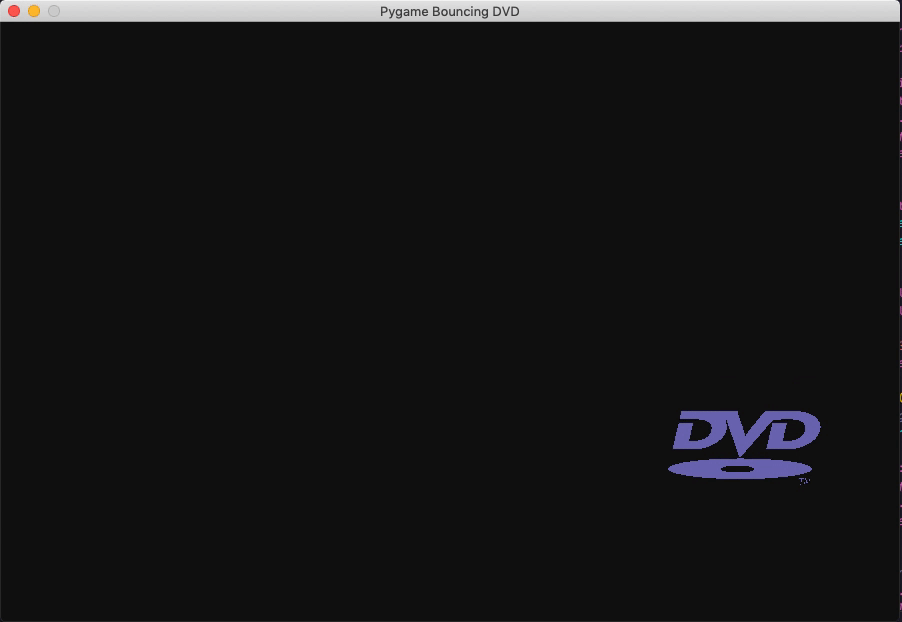
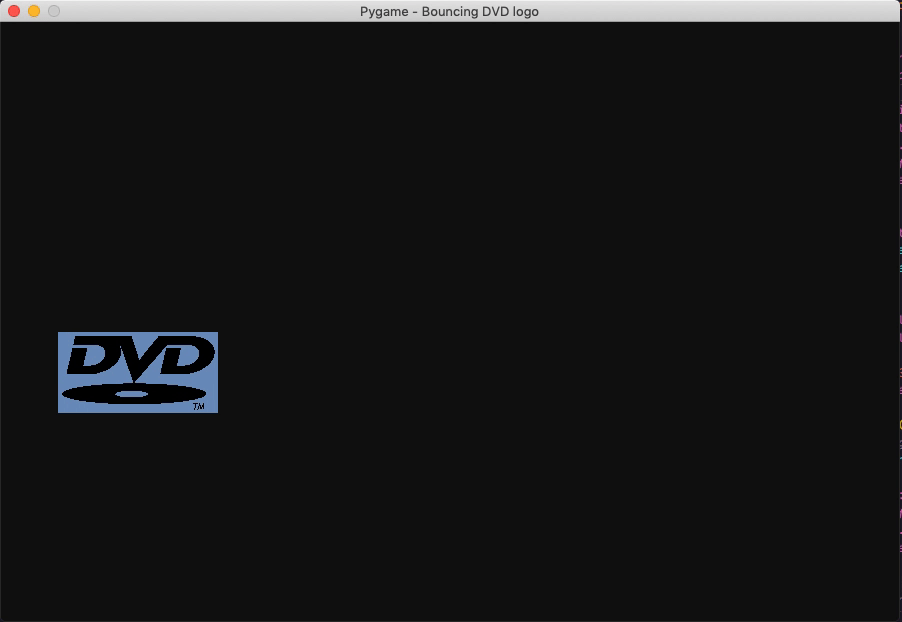

# Bouncing DVD logo - Pygame
 

> A little ride back to the 90s. Ah good ol' time! Didn't we all wait for the logo to hit the corners? *Best feeling ever!!*

I have seen some implementations on the internet using Pygame, but none of them has the color change when the logo bounces off wall. So I decided to create my version as a fun, mini project to teach my students Pygame's basic object movements.

You can change either foreground or background color, the code is set to foreground color change by default. In `main.py`, simply set the variable `option` to `1` for foreground or `2` for background color change.

#### Foreground color change (YES IT HITS THE CORNER!)

#### Background color change

# Connect with me
* My [personal website](https://hoangdesu.com/)
* My [LinkedIn](https://www.linkedin.com/in/hoangdesu/)
* My [Facebook](https://www.facebook.com/Hoangdayo/)
* My [Instagram](https://www.instagram.com/hoang.desu/)
* You can shoot me an [email](mailto:hoangdesu@gmail.com) too

If this little piece of code brought you back some good memories, drop me a star ⭐️ !